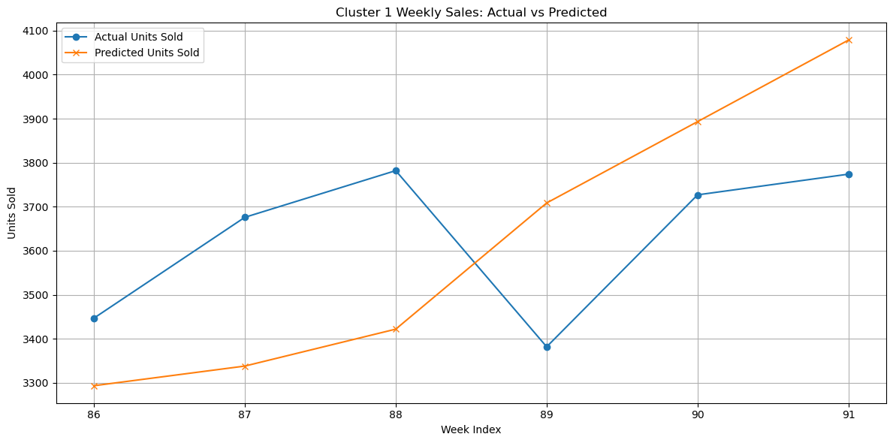
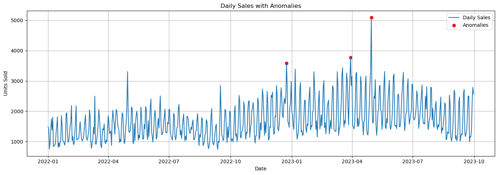

# Mexico Toy Sales Forecasting Project

  
  
  
  

This project builds and evaluates weekly sales forecasting models for Maven Toys stores across Mexico. It integrates multiple data sources, performs extensive EDA (including clustering and anomaly detection), engineers rich time-series features (lags, rolling stats, seasonality, holidays), and delivers two best-in-class XGBoost pipelines for overall and region-specific forecasts.

---

## Table of Contents

- [Project Preview](#-project-preview)  
- [Dataset Overview](#dataset-overview)  
- [Data Preprocessing](#data-preprocessing)  
- [Exploratory Data Analysis](#exploratory-data-analysis)  
- [Clustering & Segmentation](#clustering--segmentation)  
- [Feature Engineering](#feature-engineering)  
- [Predictive Modeling](#predictive-modeling)  
- [Forecast Visualizations](#forecast-visualizations)  
- [Technologies Used](#technologies-used)  
- [Project Structure](#project-structure)  
- [Author & License](#author--license)  

---

## Project Preview

**Cluster-Level Forecast (Cluster 1)**  
  
*Actual vs. predicted weekly sales for one store cluster.*

**Daily Sales with Anomalies**  
  
*hree major outlier days were identified using Z-score analysis (|Z| > 3)*

---

## Dataset Overview

We merge five CSV sources into one unified analysis table:

| File             | Records      | Key Fields                                     |
|------------------|--------------|------------------------------------------------|
| `sales.csv`      | 829,262 rows | `sale_id`, `date`, `store_id`, `product_id`, `units` |
| `products.csv`   | 35 products  | `product_id`, `product_name`, `category`, `cost`, `price` |
| `stores.csv`     | 50 stores    | `store_id`, `store_name`, `city`, `location_type`, `open_date` |
| `inventory.csv`  | ~34,000 rows | `store_id`, `product_id`, `stock_on_hand`      |
| `calendar.csv`   | ~90 weeks    | `date`, `is_holiday`                           |

---

## Data Preprocessing

- **Merge & Validate:** Joined all datasets on `store_id`, `product_id`, and `date`; confirmed 1:1 sales row counts.  
- **Clean & Transform:**  
  - Stripped dollar signs and converted price/cost to `float`.  
  - Parsed `date` and `store_open_date` as `datetime`.  
  - Flagged 6,232 missing inventory records.  
- **Flag & Feature:**  
  - Created `missing_inventory` boolean.  
  - Computed `store_age_years` from opening dates.  

---

## Exploratory Data Analysis

- **Descriptive Stats:** Summarized distributions of `units`, `cost`, `price`, and `stock_on_hand`.  
- **Time Trends:** Plotted daily & monthly units sold to identify seasonality and spikes.  
- **Anomaly Detection:** Flagged weeks with z-score >3 and product-level outliers.  
- **Inventory Insights:** Top products by average stock and stock-to-sales ratios; correlation scatter of stock vs. sales.  
- **Missing Inventory:** Top stores with missing data for follow-up.

---

## Clustering & Segmentation

- **City-Level Aggregation:** Summed `units` & `revenue`, averaged `stock_on_hand` by `store_city`.  
- **K-Means (k=4):** Segmented cities into 4 clusters based on sales, revenue, and stock profiles.  
- **Cluster Summary:** Mapped each store to its city cluster for regional modeling.

---

## Feature Engineering

1. **Weekly Aggregation:** Resample daily sales to weekly sums; average price, cost, stock.  
2. **Time Features:** ISO week, month, year.  
3. **Lag Features:** `lag_1`–`lag_4` of `units`.  
4. **Rolling Stats:** 4-week moving mean & std of `units`.  
5. **Seasonality:** `sin_week`, `cos_week` for weekly cycle.  
6. **Holiday Flags:** Merge `calendar.csv` to add binary `is_holiday` per week.  
7. **Turning-Point Features:** Optional `momentum` & `acceleration` based on lag differences.

---

## Predictive Modeling

### 1. Cluster-Level Extended-Feature XGBoost + Holiday  
- **Scope:** Weekly sales per cluster  
- **Tuning:** RandomizedSearchCV (50 combos, 4-fold TimeSeriesSplit)  
- **Hold-out (6 weeks):**  
  - MAE: **222.27**  
  - RMSE: 295.57  
  - MAPE: **6.80%**  

### 2. Overall Weekly XGBoost + Holiday  
- **Scope:** Aggregate weekly sales  
- **Tuning:** RandomizedSearchCV (30 combos, 4-fold TimeSeriesSplit)  
- **Hold-out (6 weeks):**  
  - MAE: **533.77**  
  - RMSE: 701.42  
  - MAPE: **4.64%**  

_Both pipelines are retained in the main flow; all other baselines (product-level XGB, Prophet, RandomForest, LightGBM, extended-lag only) are archived._

---

## Forecast Visualizations

1. **Actual vs. Predicted** plots for each cluster and the overall series.  
2. **Residual Correction** chart showing improved alignment after bias adjustment.  
3. **Feature Importance** bar charts highlighting key drivers (rolling mean, lags, holiday flag).

---

## Technologies Used

- **Language & Notebooks:** Python 3.10, Jupyter Notebook  
- **Data:** Pandas, NumPy  
- **Visualization:** Matplotlib  
- **Machine Learning:** Scikit-Learn, XGBoost, LightGBM (archived), KMeans  
- **Version Control:** Git / GitHub  

---

## Project Structure

mexico_toy_project/ 
├── data/ 
│ ├── sales.csv 
│ ├── products.csv 
│ ├── stores.csv 
│ ├── inventory.csv 
│ └── calendar.csv 
├── notebooks/ 
│ └── mexico_toy_project.ipynb # Main analysis, modeling, visualization 
├── figures/ 
│ ├── overall_forecast.png 
│ ├── cluster0_forecast.png 
│ ├── feature_importance.png 
│ └── residual_correction.png 
├── README.md # This file 
└── LICENSE # MIT License 

---

**Author:** Matt Baglietto  
